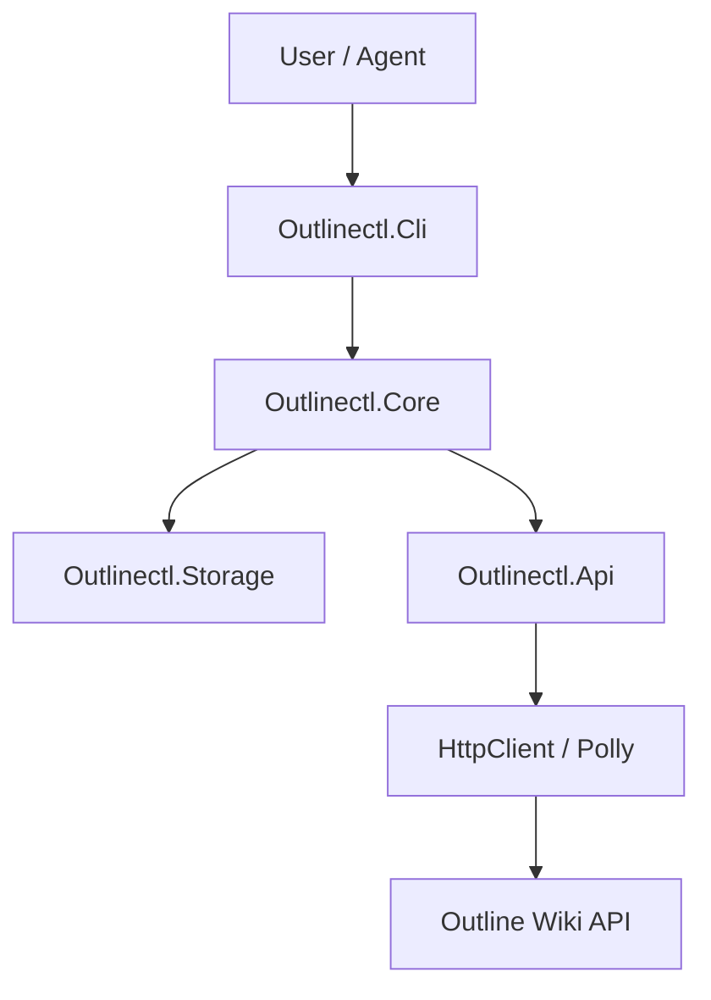

# Design Document: Outlinectl

## Overview
Outlinectl is a cross-platform CLI tool built on .NET 10 that provides a programmatic interface to the Outline Wiki. It is designed to be "agent-friendly" by offering deterministic JSON outputs, strict exit codes, and robust authentication mechanisms suitable for both local development and CI/CD pipelines.

## Architecture

The application will be structured as a modular .NET solution with a Clean Architecture approach to separate concerns between the CLI presentation layer, core logic, and external API integration.

### High-Level Components



### Technology Stack
-   **Framework:** .NET 10
-   **CLI Parsing:** `System.CommandLine`
-   **JSON Serialization:** `System.Text.Json` (Source generation for performance and strictness)
-   **HTTP Client:** `Microsoft.Extensions.Http` + `Polly` (Resilience)
-   **DI:** `Microsoft.Extensions.DependencyInjection`

## Components and Interfaces

### 1. Outlinectl.Cli
Responsible for parsing arguments, formatting output, and handling the exit process.

*   `Program.cs`: Entry point, sets up DI container and root command.
*   `CommandFactory`: Registers commands (`auth`, `docs`, `collections`, `config`).
*   `OutputFormatter`: Handles rendering of data to either `Text` (tables/messages) or `JSON` (structured envelopes) based on flags.
*   `ExitHandler`: Maps exceptions and results to specific integer exit codes.

### 2. Outlinectl.Core
Contains the business logic, domain models, and abstractions.

*   `Services/IDocumentService`: Orchestrates document operations (Search, Get, Create, Update).
*   `Services/IAuthService`: Manages login/logout and token retrieval logic.
*   `Services/IConfigService`: Manages profile storage and retrieval.
*   `Domain/*`: Core domain entities (Document, Collection, Profile).

### 3. Outlinectl.Api
Handles communication with the Outline API.

*   `IOutlineApiClient`: Interface for API operations.
*   `OutlineApiClient`: Implementation using `HttpClient`.
*   `AuthHeaderHandler`: Delegating handler to inject the Bearer token from the secure store or env vars.
*   `ResiliencePolicy`: Polly policies for retries (429, 5xx) and timeouts.
*   `DTOs/*`: Request/Response objects mapping directly to Outline API JSON.

### 4. Outlinectl.Storage
Manages persistence of configuration and secrets.

*   `IStore`: Abstraction for reading/writing config.
*   `FileStore`: JSON-based file storage for profiles (non-sensitive).
*   `KeyStore`: Secure storage for API tokens (using OS-specific credential stores/keychains where possible, or falling back to secure file permissions if needed/configured).
*   `DedupeDb`: Simple local store (e.g., JSON or SQLite) for `dedupe-key` idempotency checks.

## Data Models

### JSON Envelope (Output)
All JSON output will follow this strict schema:
```json
{
  "ok": true, // or false
  "command": "command.name",
  "data": { ... }, // Payload
  "error": { ... }, // Null if ok=true
  "meta": {
    "requestId": "...",
    "durationMs": 120,
    "version": "1.0.0"
  }
}
```

### Document Model (Core)
```csharp
public record Document
{
    public string Id { get; init; }
    public string Title { get; init; }
    public string Text { get; init; } // Markdown content
    public string Url { get; init; }
    public string CollectionId { get; init; }
    public DateTimeOffset CreatedAt { get; init; }
    public DateTimeOffset UpdatedAt { get; init; }
    // ...
}
```

### Configuration Profile
```json
{
  "profiles": {
    "default": {
      "baseUrl": "https://docs.example.com",
      "timeout": 30
    }
  },
  "currentProfile": "default"
}
```

## Error Handling
The application will map exceptions to specific exit codes:

| Scenario | Exit Code | Description |
| :--- | :--- | :--- |
| Success | 0 | Operation completed successfully. |
| Validation Error | 2 | Invalid arguments or input. |
| Auth Failure | 3 | Invalid token or unauthorized. |
| Not Found | 4 | Resource (doc/collection) not found. |
| Conflict | 5 | Optimistic concurrency failure or duplicate. |
| Rate Limit/Network | 6 | Retries exhausted. |
| Unknown Error | 10 | Unhandled exception. |

Global exception handling middleware in the CLI layer will catch unhandled exceptions, log them (redacting secrets), and produce the JSON error envelope if `--json` mode is active.

## Testing Strategy

### Unit Tests (`Outlinectl.Tests`)
-   **Core Services:** Test business logic, mocking `IOutlineApiClient` and `IStore`.
-   **CLI Parsing:** Verify that flags and arguments map correctly to command handlers.
-   **Output Formatting:** Ensure JSON serialization adheres strictly to the envelope schema.

### Integration Tests
-   **API Client:** Test against a mock HTTP server (e.g., WireMock.Net) to verify header injection, DTO mapping, and retry policies without hitting a real Outline instance.
-   **Storage:** Verify file reading/writing and secure credential storage mechanisms on supported platforms.

### End-to-End (E2E) Verification
-   **Manual Script:** A script that utilizes the CLI to perform a full lifecycle: Login -> Create Collection -> Create Doc -> Search -> Update -> Export -> Delete.
-   **Agent Simulation:** Run the CLI in a sub-process, parse stdout JSON, and verify fields, simulating how an agent would use it.

## Plan for Idempotency
For `docs create`, the `DedupeDb` will store a map of `dedupe-key` -> `documentId`.
Before creating, the system checks this store.
1.  **Check:** exist? return stored ID.
2.  **Create:** call API.
3.  **Store:** save key -> new ID.
This ensures that if an agent retries a creation with the same key, it doesn't create duplicate documents.
